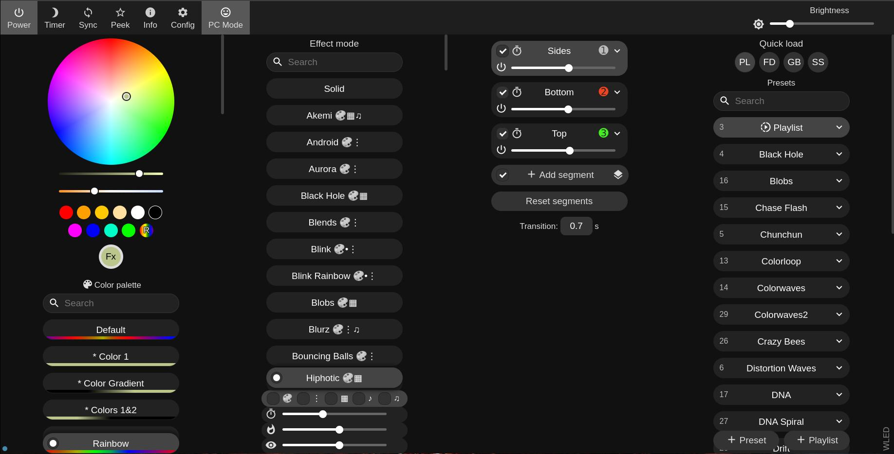
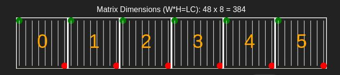

# Cube LED 8x8x6

Implementation of a LED Cube with the ESP32 and WS2812 LED panels.

<table>
	<tr>
		<td>
			Don't forget to star ⭐ this repository
		</td>
	</tr>
</table>

## 2023 improvements

[](https://youtu.be/n3Il7YY6cuw?si=VEuiso4gGK9vzJ8l)

## Build and install

Please, install first [PlatformIO](http://platformio.org/), open source ecosystem for IoT development compatible with **Arduino**, and its command line tools (Windows, MacOs and Linux). Also, you may need to install [git](http://git-scm.com/) in your system. After that please connect your ESP32 board and run the next lines:

``` bash
git clone https://github.com/hpsaturn/cube_led_8x8x6_ws2812.git
cd cube_led_8x8x6_ws2812 
pio run --target upload
```

## Alternative: WLED

This Cube is compatible with the awesome firmware [WLED](https://github.com/Aircoookie/WLED#readme). You only need install it and load the preset and config from the directory `wled` here, in this repo.

**WLED Control panel:**



**WLED 2D setup:**



## Schematics

My current setup uses the next components:

| Item              | Seller | Notes |
| :---------------- | :---------: | :------------- |
| ESP32 TTGO T7 v1.5 | [Aliexpress](https://www.aliexpress.com/item/32845357819.html) | (recommended than v1.3 or v1.4) |
| 6 LED panels 8x8 | [Aliexpress](https://www.aliexpress.com/item/32671025605.html)   | |
| Lipo Battery 3.7v | [Aliexpress](https://www.aliexpress.com/item/1005006163946823.html) | (Only a reference, could be similar) |
| Lipo charger** | [Aliexpress](https://es.aliexpress.com/item/32621399438.html) | (Plase se the note bellow) |
| switch 3mm** | [Aliexpress](https://www.aliexpress.com/item/4001207529493.html) | (Plase se the note bellow) |
| MicroUSB connector | [Aliexpress](https://www.aliexpress.com/item/1005006088838882.html) | For the charger base |
| Pogo pins | [AmazonDE](https://www.amazon.de/dp/B07FPPFWS4) | |

Note: I incorporated this additional lipo charger due to the inadequate Vin protection on my current TTGO T7 v1.3, which experiences a voltage drop across a diode. Using this LipoCharger ensures better protection, preventing voltage loss in the output and enhancing brightness. I am waiting for the arrival of a new TTGO T7 v1.5 or the new T7 S3 versions, as they feature superior protections and eliminate voltage drops. Additionally, these boards boast improved power consumption during deep-sleep mode. My plan is to eliminate the switch and maybe this extra charger, taking advantage of these enhancements.

## TODO

- [ ] Add the IMU driver on the WLED firmware
- [ ] Add final electronics diagram
- [x] Added charger base 3dprint files (first version)
- [ ] Audio

## 3D Model - body

The current version state is **"in progress"**, but you can test the first 3d models. More info for build it in [Thingiverse](https://www.thingiverse.com/hpsaturn/about).

---

<a href="https://youtu.be/KPNUmPd9I_Y" target="_blank"></a>
