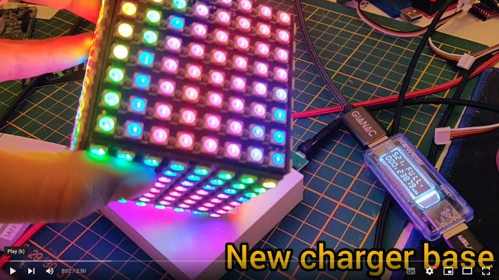

# Cube LED 8x8x6

Implementation of Cube with the ESP32 and WS2812 LED panels.

<table>
	<tr>
		<td>
			Don't forget to star ⭐ this repository
		</td>
	</tr>
</table>

## Build and install

Please, install first [PlatformIO](http://platformio.org/), open source ecosystem for IoT development compatible with **Arduino**, and its command line tools (Windows, MacOs and Linux). Also, you may need to install [git](http://git-scm.com/) in your system. After that please connect your ESP32 board and run the next lines:

``` bash
git clone https://github.com/hpsaturn/cube_led_8x8x6_ws2812.git
cd cube_led_8x8x6_ws2812 
pio run --target upload
```

## Alternative: WLED

This Cube is compatible with the awesome firmware [WLED](https://github.com/Aircoookie/WLED#readme). You only need install it and load the preset and config from the directory `wled` here, in this repo.

[](https://youtu.be/n3Il7YY6cuw?si=VEuiso4gGK9vzJ8l)

## TODO

- [ ] Add the IMU driver on the WLED firmware
- [ ] Add final electronics diagram
- [ ] Add final base 3dprint files
- [ ] Audio

## 3D Model - body

The current version state is **"in progress"**, but you can test the first 3d models. More info for build it in [Thingiverse](https://www.thingiverse.com/hpsaturn/about).

---

<a href="https://youtu.be/KPNUmPd9I_Y" target="_blank"></a>
